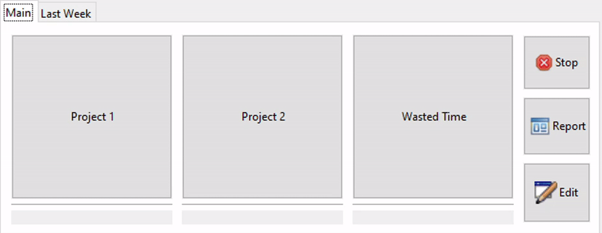
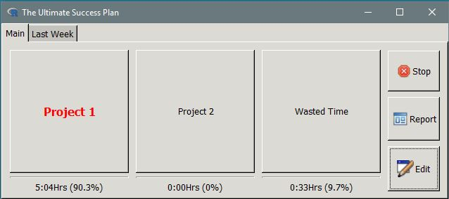

# successr
Tracking work and wasted time for ultimate success.

_successr_ is an R tool for tracking the amount of time you work (and waste) during the
day. At a metaphysical level, time can be divided into two categories: work time and
wasted time. Work time is effectively used when you focus on at most two relevant projects
during the day.  _Wasted Time_ includes anything that does not fall in _Project 1_ and/or
_Project 2_.  Culprits for _Wasted Time_ are typically toilet/cigarette/watercooler
excursions, lunch breaks, unannounced visits by the boss, any meeting, internet surfing,
chit chat with colleagues, or courtesy calls by telemarketers, friends/family, and
partner(s). Effective time use is surely the first step to ultimate
success.[<sup>1</sup>](https://www.amazon.com/Getting-Things-Done-ABCs-Management/dp/B004JFYWO2)

Clicking _Project 1_, _Project 2_, and _Wasted Time_ starts the timer,
and _Stop_ stops the timer. _Report_ gives a daily, weekly, monthly breakdown
of work time. _Edit_ allows you to edit only the time recorded during the day and
the Task (from a drop-down menu). DayData.txt allows you to edit the total time
for a given day (see below). 

Upon installation, successr will setup a data folder (where the data is stored) with a
configuration file, called config.yml. The folder can be found in `Sys.getenv("HOME")`. If
you want to specify an alternative folder path, then you must put in your .Rprofile the
following line: `Sys.setenv(R_SUCCESS = "my/folder/path")`. In my Rprofile set-up, I have
`Sys.setenv(R_SUCCESS = "~/Dropbox/successr")` so I can sync between my work and
home computers. Labels for _Project 1_, _Project 2_, _Wasted Time_ and the _Window Title_
can be changed in the config.yml file. But don't waste time doing this, just use the
default settings.  

Install using the  `remotes` package:  `remotes::install_github("vando026/successr")`.

After installation, type in `R`: 

`successr::successr()`


<p></p>


<!--  -->
<!--  -->


## Installation notes 

`successr` requires the GTK library. You may have to waste some time setting this up.

### Windows:

The GTK library is included in the `RGtk2` package when you install `successr`. But you may have to add it to the path environment variable if you get an error. On Windows, the path that you have to add should look something like this:

`C:/PathToYourRLibrary/4.X/RGtk2/gtk/x64/bin`

To understand how to add to the path environmen variable, see
<https://helpdeskgeek.com/windows-10/add-windows-path-environment-variable/>.

### Linux (Ubuntu): 

You may need to install:

```
sudo apt-get install gtk2.0
sudo apt-get install build-essential libgtk2.0-dev 
sudo apt install libcanberra-gtk-module 
```

### Mac OS
No successful installation reported on a Mac yet.
